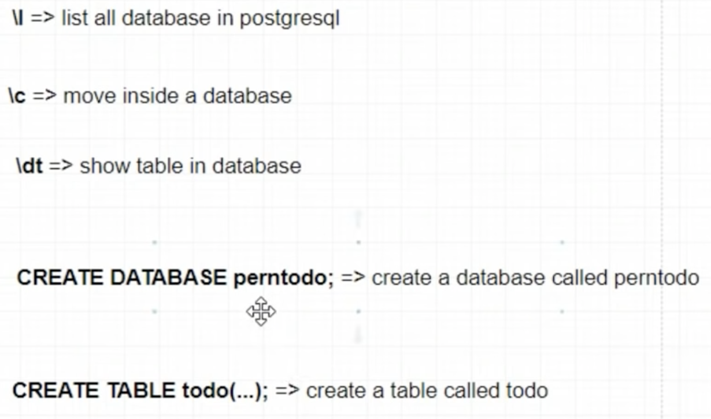
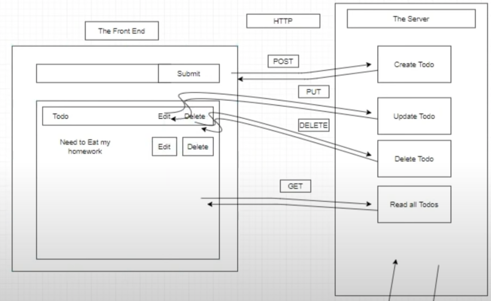
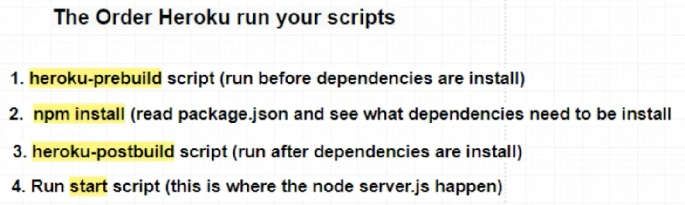

# PERN Stack Course Documentation

---

My Full Stack Application can be found [here](https://pern-fullstack-todo-tutorial.herokuapp.com).

- [PERN Stack Course Documentation](#pern-stack-course-documentation)
  - [Starting the Server](#starting-the-server)
  - [Create our Postgres Database and Table](#create-our-postgres-database-and-table)
  - [Connect database and server](#connect-database-and-server)
  - [Build Routes with PostgreSQL Queries](#build-routes-with-postgresql-queries)
    - [Create a todo](#create-a-todo)
    - [Get all todos](#get-all-todos)
    - [Get a todo based on an id](#get-a-todo-based-on-an-id)
    - [Update a todo](#update-a-todo)
    - [Delete a todo](#delete-a-todo)
  - [Restful API Overview](#restful-api-overview)
  - [Set Up the Client Side (React)](#set-up-the-client-side-react)
  - [Building The Input Todo Component](#building-the-input-todo-component)
  - [Build The List Todo Component](#build-the-list-todo-component)
  - [Build the Delete Button](#build-the-delete-button)
  - [Build the Edit Todo Component](#build-the-edit-todo-component)
  - [PERN Stack Review](#pern-stack-review)
- [How to Deploy a PERN application on Heorku](#how-to-deploy-a-pern-application-on-heorku)
  - [File Structure](#file-structure)
  - [Configure Database Connection](#configure-database-connection)
  - [Set up Scripts in package.json](#set-up-scripts-in-packagejson)
  - [Setup Proxy in Client Side](#setup-proxy-in-client-side)
  - [Set up Engines in package.json and catchall method](#set-up-engines-in-packagejson-and-catchall-method)
  - [Deploy to Heroku](#deploy-to-heroku)

## Starting the Server

Create server folder  
`mkdir server`

Install the following packages in the server folder  
`npm i express cors pg`

- pg is used for running queries in postgres
- cors a.k.a. Cross-Origin Resource Sharing (CORS). It's a middleware

Make an index.js library and initialize the express server  
`const express = require("express");`  
`const app = express();`

`app.listen(5000,()=> console.log("server has started on port 5000"));`

Instead of using `node index`, can instead run `nodemon index`. This way everytime a change is made, it is reflected in the server. Installing nodemon globally is best practice for this.

Once we know that our server works, we initialize middleware by:  
`const cors = require("cors");`  
`app.use(cors());`  
`app.use(express.json());` // allows us to access request body

## Create our Postgres Database and Table

Instructions located in `database.sql`

## Connect database and server

- really easy when using the pg library

Basically, have to make a connection file called `db.js`, and pass in the relevant parameters.

    const Pool = require("pg").Pool;

    const pool = new Pool({
    user: "postgres",
    host: "localhost",
    port: 5432,
    database: "perntodo",
    });

    module.exports = pool;

## Build Routes with PostgreSQL Queries

Need to create, read, update, and delete

### Create a todo

    // create a todo
    app.post("/todos", async (req, res) => {
    // async allows for await
    try {
        // console.log("This event is triggered");
        const { description } = req.body;
        const newTodo = await pool.query(
        "INSERT INTO todo (description) VALUES($1) RETURNING *",
        [description] // pg library allows us to add dynamic data, $1 allows us to dynamically add values
        // RETURNING * allows you to get back the data again, that was added or inserted or updated
        );
        res.json(newTodo.rows[0]);
    } catch (err) {
        console.log(err.message);
    }
    });

### Get all todos

    // get all todos
    app.get("/todos", async (req, res) => {
    try {
        const allTodos = await pool.query("SELECT * FROM todo");
        res.json(allTodos.rows);
    } catch (error) {
        console.log(error.message);
    }
    });

### Get a todo based on an id

    // get a todo
    app.get("/todos/:id", async (req, res) => {
    try {
        const { id } = req.params;
        const todo = await pool.query("SELECT * FROM todo WHERE todo_id = $1", [
        id,
        ]);
        res.json(todo.rows[0]);
    } catch (error) {
        console.log(error.message);
    }
    });

### Update a todo

    // update a todo
    app.put("/todos/:id", async (req, res) => {
    try {
        const { id } = req.params;
        const { description } = req.body;
        console.log(description);
        const updateTodo = await pool.query(
        "UPDATE todo SET description = $1 WHERE todo_id= $2",
        [description, id]
        );

        res.json("Todo was updated!");
    } catch (err) {
        console.log(err.message);
    }
    });

### Delete a todo

    // delete a todo
    app.delete("/todos/:id", async (req, res) => {
    try {
        const { id } = req.params;
        const deleteTodo = await pool.query("DELETE FROM todo WHERE todo_id=$1", [
        id,
        ]);
        res.json("Todo was deleted");
    } catch (err) {
        console.log(err);
    }
    });

    app.listen(5000, () => {
    console.log("server has started on port 5000");
    });

## Restful API Overview

To write info, send a `POST` request

To read info, send a `GET` request

To update info, send a `PUT` request

To delete info, send a `DELETE` request

## Set Up the Client Side (React)

In the project folder:  
`npx create-react-app client`

- This will create a react folder called client. This is where we will do all client sided programming.

`npm start`

- Go ahead and start the server on React side

The different components that will be part of our app will be as follows

After executing the initialization script, need to delete a few items in the src folder, and your final src folder should only contain the following:

- App.css
- App.js
- index.css
- index.js

`import React from "react"` in the `App.js` file

Create a components folder and add in the components that you were going to add. In our case, this is:

- EditTodo.js
- InputTodo.js
- ListTodos.js (notice Todos is plural here, naming is important)

Also Bootstrap 4 will be used in this tutorial.
Add Bootstrap **CSS** AND **JS** into the `public` > `index.html` file

## Building The Input Todo Component

    import React, { useState } from "react";

    const InputTodo = () => {
    const [description, setDescription] = useState("");
    const onSubmitForm = async (e) => {
        e.preventDefault();
        try {
        const body = { description };
        const response = await fetch("http://localhost:5000/todos", {
            method: "POST",
            headers: { "Content-Type": "application/json" },
            body: JSON.stringify(body),
        }); // default is fetch makes GET requests, have to add an object with all the options
        console.log(response);
        window.location = "/";
        } catch (err) {
        console.log(err.message);
        }
    };
    return (
        <>
        <h1 className="text-center mt-5">Pern Todo List</h1>
        <form className="d-flex mt-5" onSubmit={onSubmitForm}>
            <input
            type="text"
            className="form-control"
            value={description}
            onChange={(e) => setDescription(e.target.value)}
            />
            <button className="btn btn-success">Add</button>
        </form>
        </>
    );
    };

    export default InputTodo;

## Build The List Todo Component

    import React, { useEffect, useState } from "react";

    const ListTodos = () => {
    const [todos, setTodos] = useState([]);
    const getTodos = async () => {
        try {
        const response = await fetch("http://localhost:5000/todos");
        const jsonData = await response.json();

        setTodos(jsonData);
        } catch (err) {
        console.error(err.message);
        }
    };
    useEffect(() => {
        getTodos();
    }, []);
    return (
        <>
        <table className="table mt-5 text-center">
            <thead>
            <tr>
                <th>Description</th>
                <th>Edit</th>
                <th>Delete</th>
            </tr>
            </thead>
            <tbody>
            {todos.map((todo) => (
                <tr>
                <td>{todo.description}</td>
                <td>Edit</td>
                <td>Delete</td>
                </tr>
            ))}
            </tbody>
        </table>
        </>
    );
    };

    export default ListTodos;

## Build the Delete Button

Add a delete button to the table, and set its onclick property to function deleteTodo(todo.todo_id). Here we are passing the id as a parameter to the function.

Next define the function as follows

    // delete todo function
    const deleteTodo = async (id) => {
        try {
        const deleteTodo = await fetch(`http://localhost:5000/todos/${id}`, {
            method: "DELETE",
        });
        setTodos(todos.filter((todo) => todo.todo_id !== id));
        } catch (err) {
        console.log(err.message);
        }
    };

## Build the Edit Todo Component

1.  Used a modal component copied from w3 schools to edit information
2.  Defined a function to update information, which involved sending a `PUT` request to the server, and then refreshing the page

        import React, { useState } from "react";

        const EditTodo = ({ todo }) => {
        const [description, setDescription] = useState(todo.description);

        //   edit description function
        const updateDescription = async (e) => {
            e.preventDefault();
            try {
            const body = { description };
            const response = await fetch(
                `http://localhost:5000/todos/${todo.todo_id}`,
                {
                method: "PUT",
                headers: { "Content-Type": "application/json" },
                body: JSON.stringify(body),
                }
            );
            window.location = "/";
            console.log(response);
            } catch (err) {
            console.log(err.message);
            }
        };
        return (
            <>
            <button
                type="button"
                className="btn btn-warning"
                data-toggle="modal"
                data-target={`#id${todo.todo_id}`}
            >
                Edit
            </button>

        
 setDescription(todo.description)}
        >
            

            

                

                <h4 className="modal-title">Edit Todo</h4>
                <button
                    type="button"
                    className="close"
                    data-dismiss="modal"
                    onClick={() => setDescription(todo.description)}
                >
                    &times;
                </button>
                

                

                <input
                    type="text"
                    className="form-control"
                    value={description}
                    onChange={(e) => setDescription(e.target.value)}
                />
                

                

                <button
                    type="button"
                    className="btn btn-warning"
                    data-dismiss="modal"
                    onClick={(e) => updateDescription(e)}
                >
                    Edit
                </button>
                <button
                    type="button"
                    className="btn btn-danger"
                    data-dismiss="modal"
                    onClick={() => setDescription(todo.description)}
                >
                    Close
                </button>
                

            

            

        

        </>
        );
        };

        export default EditTodo;

## PERN Stack Review

1. We first set up the database
2. We then routed requests, and tested these request with POSTMAN
3. Then we went ahead and created a react app folder using `npx create-react-app client`
4. We made a bunch of fetch requests to the server to Create, Read, Update, and Delete our Todo list items.

# How to Deploy a PERN application on Heorku

Based off Youtube [video](https://www.youtube.com/watch?v=ZJxUOOND5_A)

1. Download and install the Heroku CLI
2. Deploy your app to github preferably

.git directory should be located in your root directory

## File Structure

- heroku stipulates that package.json file must be in the root directory
- As such place all server code into the root directory

In the index.js file, have to use `process.env.PORT`  
`const PORT = process.env.PORT || 5000;`

- change all instances of 5000 to PORT

- also going to use `process.env.NODE_ENV` to determine if we are in production or not

  - if we are in production environment, then run the client/build/index.html. The way we would do this is by making the build folder accessible to `index.js` in server. This is achieved through the below code

        if (process.env.NODE_ENV === "production") {
        // server static content
        // npm run build
        app.use(express.static(path.join(\_\_dirname, "client/build")));
        }

## Configure Database Connection

Have to modify `db.js`

Install a library that will allow you to hide all of the secret info so it doesn't get deployed with heroku  
`npm i dotenv`

Create a `.env` file and put all configurations from `db.js` to `.env`

`db.js` will look like follows:

    const Pool = require("pg").Pool;
    require("dotenv").config();

    const devConfig = {
    user: process.env.PG_USER,
    host: process.env.PG_HOST,
    port: process.env.PG_PORT,
    database: process.env.PG_DATABASE,
    };

    const proConfig = {
    connectionString: process.env.DATABASE_URL, // heroku addons
    };

    const pool = new Pool(
    process.env.NODE_ENV === "production" ? proConfig : devConfig
    );

    module.exports = pool;

- basically if the process.env.NODE_ENV is production, then use production config settings, otherwise use the developer config settings

`.env` file will look like follows:

    PG_USER = postgres
    PG_HOST = localhost
    PG_PORT = 5432
    PG_DATABASE = perntodo

## Set up Scripts in package.json

In the package.json file, need to modify a few things

So we are going to first install all the dependencies and then run the heroku-postbuild, and then start

We need to make the following changes in the `scripts` of the `package.json` file

    "start": "node index.js",
    "heroku-postbuild": "cd client && npm install && npm run build"

## Setup Proxy in Client Side

will help to shorten URL
go to client `package.json` file, and add

    "proxy": "http://localhost:5000"

Once this step is completed, remove the `http://localhost:5000`, because you no longer need it.  
node will automatically add the proxy if it is on development machine

## Set up Engines in package.json and catchall method

In root `package.json`, define the `node` and `npm` versions. Add it in the the `package.json`:

    "engines": {
        "node": "14.15.3",
        "npm": "6.14.10"
    }

In server index.js, add this catchall method

    // catch all method has to be in the bottom
    app.get("*", (req, res) => {
    res.sendFile(path.join(__dirname, "client/build/index.html"));
    });

## Deploy to Heroku

After installing the heroku CLI  
`heroku login`

To create an app  
`heroku create pern-fullstack-todo-tutorial`

Then need to add postgres addon to heroku  
`heroku addons:create heroku-postgresql:hobby-dev -a pern-fullstack-todo-tutorial`

Can access postgresql on heroku via  
`heroku pg:psql -a pern-fullstack-todo-tutorial`

The pipe basically uses the database.sql as input into the heroku postgresql  
`cat database.sql | heroku pg:psql -a pern-fullstack-todo-tutorial`

To connect the git repository to heorku  
`heroku git:remote -a pern-fullstack-todo-tutorial`

To then push to heroku, we say  
`git push heroku master`

To open our app from command line, we say  
`heroku open`
